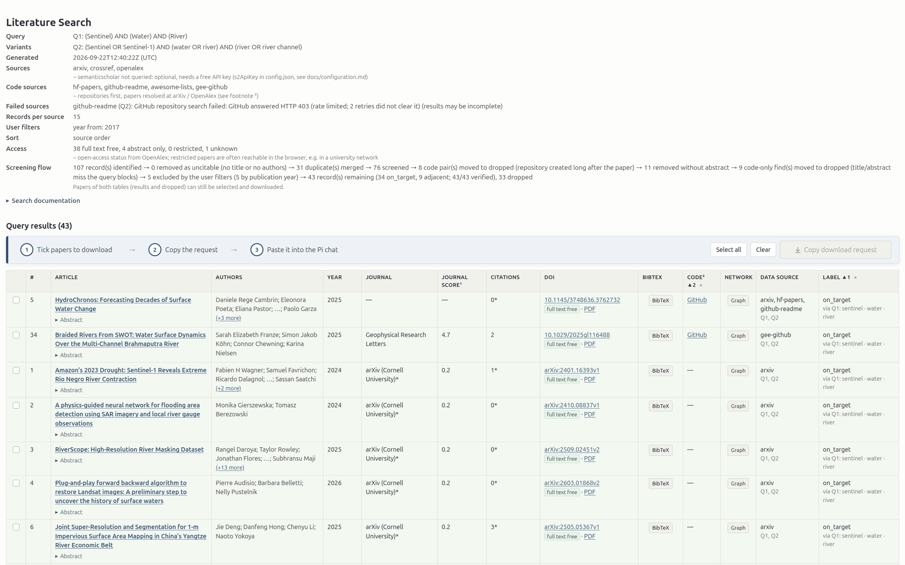
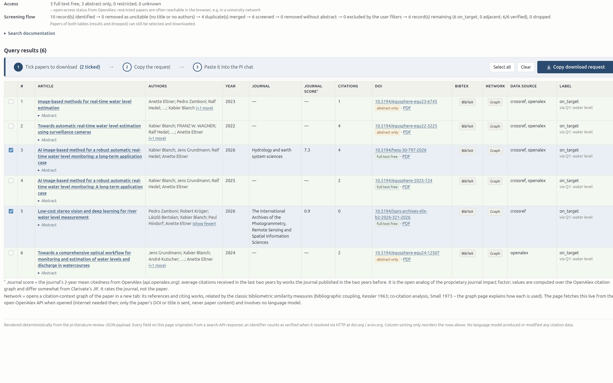
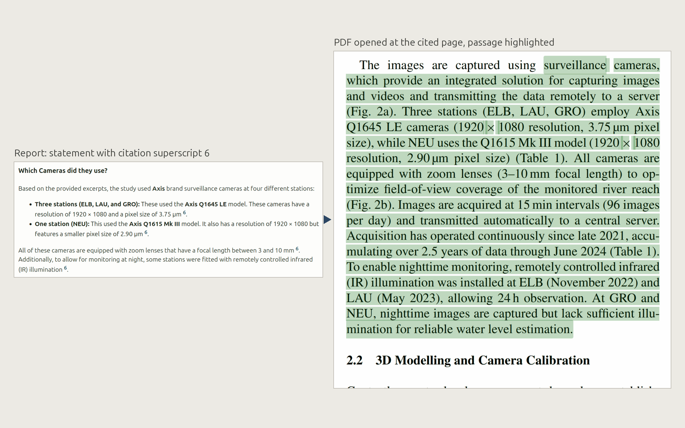
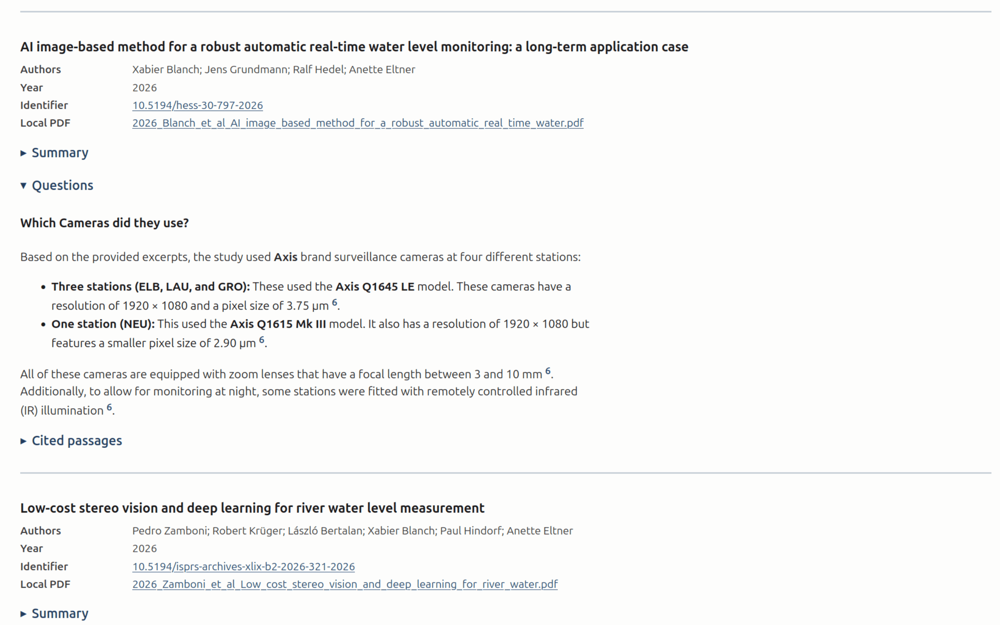

# pi-literature-review

Local, open, login-free literature review extension for the
[Pi coding agent](https://pi.dev). One package, three tools: `/lit-search`
for searching, `/lit-selection` for downloading, `/lit-synthesis` for
understanding academic literature.

Uses the public APIs of arXiv, CrossRef, OpenAlex and Semantic Scholar. No
account, no key, no paid service required. No subscription to a frontier
model needed either: everything can run locally, using just a small LLM and
a small embedding model ([requirements and tested
setups](docs/requirements.md)).


All output is written to the directory where you started Pi:

| Stage | Command | What it does | Creates |
|---|---|---|---|
| Literature search | `/lit-search` | Searches arXiv, CrossRef, OpenAlex and Semantic Scholar; filters, deduplicates, verifies, enriches and labels the records | One HTML page + JSON file per run in `lit-search/` |
| Literature selection | `/lit-selection` | Downloads the papers you ticked on the results page (legal open access only) | A PDF library in `lit-selection/` |
| Literature synthesis | `/lit-synthesis` | Chats about one paper or builds a report across one or several papers (PDFs), with page-exact citations | HTML reports and chat protocols in `lit-synthesis/` |

**The one inviolable rule: models never modify or generate paper data.**
All metadata, abstracts, PDF text, filtering, verification and citations
are handled by APIs and deterministic code. The embedding model only finds
relevant passages; the LLM suggests search-query variants and writes
answers, summaries and syntheses from those passages.

## Highlights

**A search strategy built with you, not for you.** The `/lit-search`
wizard takes your query as keyword blocks (one concept per block, synonyms
with OR), lets the model suggest variants you can tick, edit or steer, and
lists the journals and authors of your topic with hit counts and open
metrics (2-year citation rate, h-index) to include or exclude. Every
result shows which query found it and which terms made it on-target.

**A search report the way a methods section needs it.** Every run ends in
a sortable HTML page: title, authors, year, journal, open journal and
citation metrics, verified DOI, BibTeX, and an on-target / adjacent label
that names the matched terms. A collapsed "Search documentation" block
holds the exact query each database received, the raw hit counts per
source and query, and a PRISMA-2020-style flow diagram of the run,
downloadable as SVG for the methods section.


**A citation graph per paper.** Every row has a Graph button. It opens the
paper's citation context: its references and the works citing it, linked
by bibliographic coupling and co-citation, so clusters of related
literature become visible. Useful for spotting the paper everyone in a
field cites but your query missed. The graph is fetched live from OpenAlex
only when you open it; only the DOI or title leaves your machine.


**Papers with code.** Tick "Search for papers with code" and the run also
searches the other way round: from Hugging Face Papers, GitHub READMEs,
curated awesome lists and Google Earth Engine repositories back to the
papers they implement. Every record with a known repository shows a Code
link; a date check keeps later third-party reimplementations apart from
the authors' own code.



**Download in two clicks.** Tick rows on the results page, press "Copy
download request" and paste the sentence into the chat. The PDFs are
fetched through legal open-access routes only (publisher, Unpaywall,
arXiv), filed under readable names, and every paper that could not be
fetched is reported honestly with the reason and a browser link.



**Citations that land on the highlighted sentence.** Every reference in a
synthesis answer or report carries the page it came from. Click it and the
PDF opens at that page with the cited passage highlighted -- not the page,
the passage. The code reproduces the PDF viewer's own text matching to
guarantee the highlight actually lands. Checking a claim is one click.



**Synthesis over a whole library.** Point `/lit-synthesis` at one, several
or all PDFs: a structured summary per paper, your questions answered per
paper or across papers, and an optional review synthesis, all in one HTML
report with clickable page-exact citations. Runs locally on a small model.



## Install

```bash
pi install npm:pi-literature-review                        # once published
pi install git:github.com/florian-lindenberger/pi-literature-review    # from the repository
```

Two direct dependencies, `fast-xml-parser` (arXiv responses) and `unpdf`
(PDF text), nine small packages in total, no install scripts. The Pi
packages it builds on come with Pi itself
([details](docs/development.md#dependencies)).

Search and selection work out of the box, even with no model selected in
Pi. Synthesis needs one local embedding model: the first `/lit-synthesis`
checks for it and offers to fetch it (Ollama, ~1.2 GB, one-time, stays on
your machine; llama.cpp or a remote API can be configured instead, see
[Configuration](docs/configuration.md)). Answers and summaries are written
by the model you selected in Pi. See [Requirements](docs/requirements.md)
for tested model and hardware combinations.

What you are installing: three tools and three slash commands that write
only into the `lit-*/` folders of your working directory and a small
config file under your user profile, and contact only the endpoints listed
under [Privacy](#privacy). How the synthesis stage guards the agent is
described in [Synthesis](docs/synthesis.md).

## Usage

Three slash commands. Pi runs them before the agent, so each opens its
terminal dialog directly, with any model or none:

- `/lit-search` -- literature search (tabbed wizard: query, query variants,
  period, records per source, code, journals, authors, filters)
- `/lit-selection` -- download papers by DOI / arXiv ID
- `/lit-synthesis` -- chat about a paper, summarize, synthesize

Or just ask in the chat; the agent calls the same tools and the same
dialogs open:

- `I want to conduct a literature review on satellite remote sensing for water classification in rivers`
- `Which cameras do Blanch et al. (2026) use in their paper "Image-based method for real-time water level monitoring"?`

The three stages hand over to each other through the results page: tick
rows, press "Copy download request", paste the sentence into the chat, and
`/lit-selection` fills the library that `/lit-synthesis` works on. Every
dialog can be left with Esc before anything is sent.

## Privacy

The package talks only to public, login-free endpoints, and only the
search text or a paper identifier is sent:

- search and verification: arXiv, CrossRef, OpenAlex, Semantic Scholar,
  doi.org, arxiv.org
- code links (only when enabled): Hugging Face Papers, GitHub, ecosyste.ms
- downloads: Unpaywall for the open-access location, then the publisher or
  repository that hosts the PDF
- the citation graph: OpenAlex, fetched by your browser when you open it

No accounts, no scraping, no telemetry. The only personal datum is an
optional contact email for Unpaywall that you enter yourself. Paper text
is seen only by your local embedding server and by the model selected in
Pi. With local models nothing leaves your machine; if you pick a cloud model
in Pi or configure a remote backend, the text excerpts go to that provider.
Check first that the papers' licenses and your institution's rules allow
that (see [Configuration](docs/configuration.md)).

## Documentation

| Document | Contents |
|---|---|
| [Requirements](docs/requirements.md) | What each stage needs, tested hardware and model setups |
| [Search](docs/search.md) | The wizard tabs, block search, the pipeline, the results page, tool parameters |
| [Selection](docs/selection.md) | Consent dialogs, resolution order, file naming, the honest per-paper report |
| [Synthesis](docs/synthesis.md) | Indexing, trust architecture, chat mode, report mode, the HTML-write gate |
| [Configuration](docs/configuration.md) | Optional: llama.cpp, remote APIs, a dedicated review model, keys -- every key and environment override |
| [Command line](docs/cli.md) | Using the package without the Pi agent |
| [Development and tests](docs/development.md) | Layout, running from a checkout, the test suite, web/RPC clients, the release acceptance gate |

## Limits

- The search covers titles, abstracts and metadata, not the full text of
  papers; Scopus, Web of Science and Sci-Hub are not used.
- A short result list is a real result: a niche query with two matching
  papers yields two, nothing is added to make the list look fuller.
- Source metadata is passed through as delivered, broken characters
  included.

## Status

Version 0.1.0. Developed and field-tested on Linux (see
[Requirements](docs/requirements.md)); Windows and macOS paths are
implemented but untested.

## Maintenance and contributions

This package grew out of a collaborative research project ("Satellite
Remote Sensing and Field Data Fusion for Hydraulic Engineering") of
[BAW](https://www.baw.de), [UPC](https://www.upc.edu/ca) and
[TU Dresden](https://tu-dresden.de/?set_language=en). It has a single
maintainer with limited time. Bug reports and pull requests are welcome, but expect
replies to take a while. Most useful right now:

- reports from Windows and macOS users: what worked, what did not
- bug reports with the run's JSON file from `lit-search/` attached, so the
  problem can be reproduced offline
- pull requests that keep the test suite and the type check green (see
  [Development and tests](docs/development.md)) and stay within the rule
  above: no model ever touches paper data

Forks are welcome, for your own field or for a different agent. Please
keep the license notice and a link back to this repository.

## Use of AI

This package was developed with substantial help from an AI coding
assistant (Claude Code by Anthropic). It was used for generating and
refactoring code and tests, debugging against the live APIs, comparing
implementation approaches, discussing design decisions and writing
documentation. It is not an author: the decisions that shape the package
were taken by the maintainer, every generated change was read, run and
tested before it entered the repository, and responsibility for the code
and the claims made about it rests with the human author. The package's
own rule held during development too: no bibliographic data shown to a
user was ever produced or edited by a model.

## License, attribution and citation

MIT (see LICENSE). The multi-source search design was inspired by
[paper-search-mcp](https://github.com/openags/paper-search-mcp) (MIT,
Copyright 2025 OPENAGS), which served as the engine during prototyping; the
sources here are implemented natively against the public APIs.

If this package supports your academic work, please cite it. The metadata
is in `CITATION.cff`; GitHub renders it under "Cite this repository" in
APA and BibTeX form.
