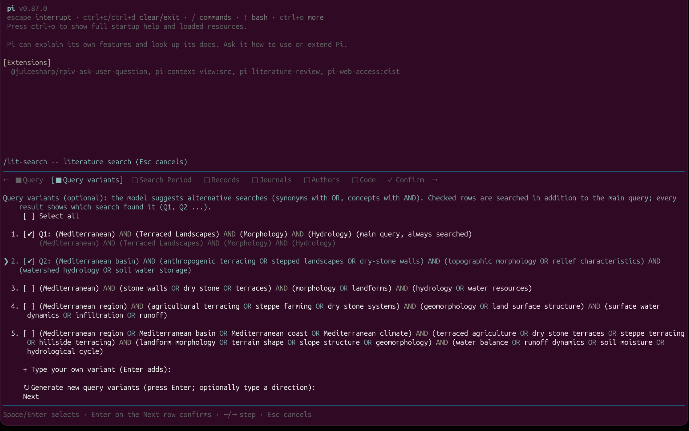
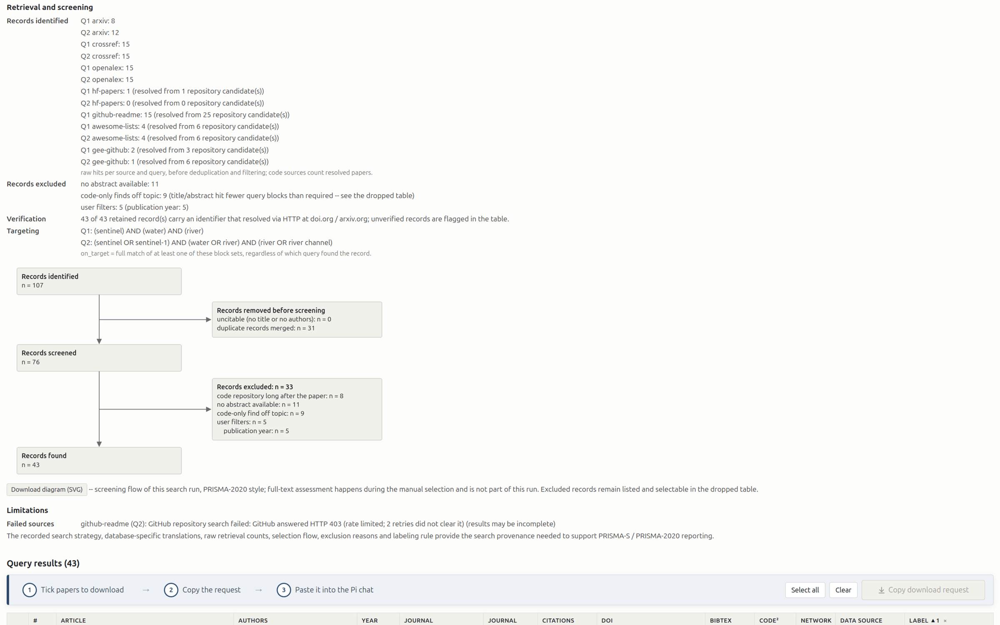
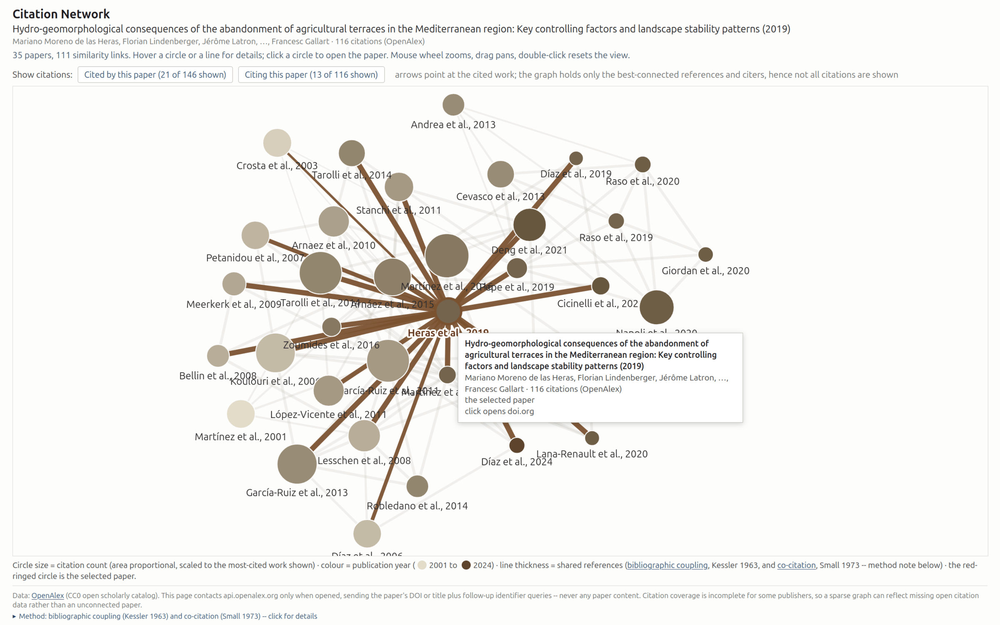

# Search (`/lit-search`)

Deterministic literature discovery over arXiv, CrossRef, OpenAlex and
Semantic Scholar. The model shapes queries at most; every record on the
page comes from an API response.

## The wizard

`/lit-search` (or a plain-words request to the agent) opens a tabbed
terminal dialog before anything is searched; an agent proposal is only the
prefill, Escape cancels without a network call. It follows the chat's
language (German/English).

- **Query** -- a keyword-block form: one concept per field ("Keyword block
  1: satellite imagery"), synonyms within a field separated by OR or comma;
  the blocks are AND-linked, five fields show by default and an "Add
  keyword block" row appends more (up to eight). Separated by a blank line,
  a free-text field takes a sentence or your own syntax instead -- when
  filled it IS the query (a warning shows while both are
  set): plain keywords derive one concept block per word, a hand-typed
  block expression (`(river OR fluvial) AND (sandbar)`) is used as written,
  quotes and arXiv field syntax pass through untouched.
- **Query variants** -- one call to the model selected in Pi suggests up to
  four alternative searches as concept-block boolean queries (OR-synonyms
  within a concept, AND between concepts), staggered narrow to broad, in
  the base query's concept order; when the base query is a block expression
  (hand-built blocks) the suggestions keep its block count and concepts and
  vary only the synonyms; one row is a computer-science phrasing
  tagged "arXiv/CS phrasing" (arXiv barely indexes domain jargon). The main
  query is locked and always runs; every checked row runs as an additional
  search in the same run; arXiv and OpenAlex receive each row as a real
  boolean query, duplicates across rows are removed, and every record is
  labeled against the blocks of ALL confirmed rows (on_target = full match
  of at least one). Add row: type your own variant. Steering row: type a
  direction, Enter regenerates four fresh suggestions; checked rows
  survive (the row carries a reload sign). Rows are separated by blank
  lines. No model: the tab offers
  only the main query.
- **Search period** -- last 5/10/20 years, all years, or `2015-2024`.
- **Records** -- per source: 5, 15, 50 (the politeness cap), or custom.
- **Journals / Authors** -- the top journals and authors OpenAlex holds
  for this query, loaded as checkbox lists with hit counts, the journal's
  2-year citedness (open impact-factor analog) and the author's citations
  and h-index, plus an "Other ..." row for everything unlisted. Both lists
  are EXCLUSION lists: every row arrives checked (all included), unticking
  a row excludes it; all or none checked = no filter. Removals survive a
  reload of the list (period or journal change), new rows arrive checked;
  an agent venues/authors proposal arrives as a checked whitelist instead.
  When only listed authors remain checked (the "Other" row unticked), the
  picked names are pushed into the source queries.
- **Filters** -- optional: minimum citations, author-name substring.
- **Confirm** -- what the tabs show is what runs.

## Block search

The concept blocks of every confirmed query have two jobs. They ARE the
search: arXiv, OpenAlex and Semantic Scholar receive them as boolean
queries; CrossRef (no boolean syntax) as relevance keywords; Semantic
Scholar's bulk endpoint returns citation-sorted results (disclosed on the
page). And they ARE the label: a record is `on_target` when its
title+abstract fully matches the blocks of ANY confirmed query, else
`adjacent`; each on_target row names the query and the exact term that hit
per block ("via Q2: river channel · water surface · satellite"). Matching
is whole-word with three tolerances -- hyphen/space, plural-s,
consonant+y -> ies -- no stemming, no synonyms.

## The pipeline (fixed code)

fetch per source and query (raw counts recorded) -> junk filter (no title
or no authors) -> deduplication by DOI / arXiv ID across sources and
variants -> HTTP verification against doi.org / arxiv.org -> enrichment
via an OpenAlex identifier lookup (missing citation counts, journal names,
abstracts filled from OpenAlex, else from Semantic Scholar by DOI, and marked `*`; journal 2-year citedness; a GitHub code
link from the abstract or one repository search per arXiv id) -> abstract
gate (no abstract = dropped table) -> the optional filters -> labeling.
Nothing disappears silently: every removed record sits in the dropped
table with its reason; a failed source is shown and the run continues.

## The results page

`lit-search/<date>_<query>.html` plus a JSON sidecar of the same basename;
self-contained and offline-readable.

- Skim metadata, then a collapsed **Search documentation**: the exact
  expression each source received per query, raw hit counts per source
  and query, the selection flow (identified -> uncitable removed ->
  duplicates merged -> screened -> removed without abstract -> excluded by
  filters -> included) and the labeling rule -- the material of a
  PRISMA-2020 flow diagram and a PRISMA-S methods section.
- **Query results** and **Dropped records** with identical columns;
  multi-level click sorting; expandable abstracts; folded author lists;
  a **BibTeX** button per row (deterministic entry from the record's
  fields); a **Graph** button per row.
- **Graph**: the paper's references and citing works, the best-connected
  35 as circles (area = citations relative to the most-cited work shown,
  colour = year), linked by bibliographic coupling and co-citation; two
  toggles ("Cited by this paper" / "Citing this paper") draw the paper's
  direct citations as arrows towards the cited work; works the paper
  cites settle to its left, works citing it to its right; hover focuses,
  hovering a line names why it exists; the mouse wheel zooms,
  dragging pans, a double-click resets the view. `network.html` next to
  the results page fetches this from OpenAlex only when opened; only the
  DOI or title is sent, no language model involved.

- **Selection bar**: tick rows in either table, "Copy download request",
  paste `Download these papers: <id>, ...` into the chat -- the handover
  to `/lit-selection`.

The agent receives only a short digest (counts, HTML path, one reference
line per record), never the full JSON.

## Tool parameters (agent and headless calls)

`query`, `query_variants`, `per_source` (default 5, cap 50), `sources`,
`group_terms` (the base query's blocks; drive fetch and label),
`min_cites`, `min_journal_score`, `year_from` / `year_to`, `venues`,
`authors`, `require_pdf`, `verified_only`, `sort` (`cites` | `year`),
`enrich` (default on), `html_file`.

Where it lives in the code: see [Development -> Module map](development.md#module-map).
